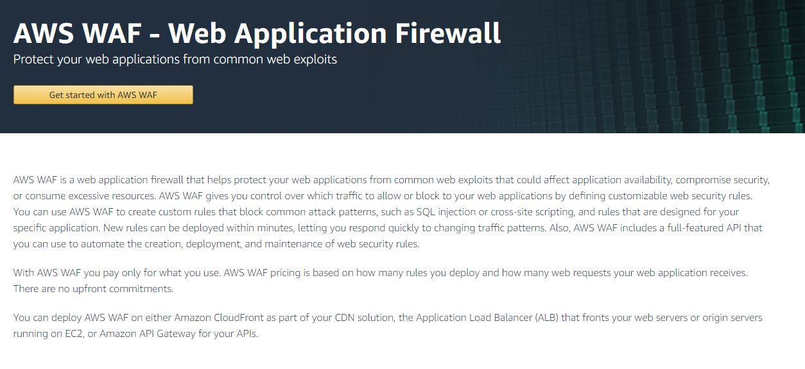
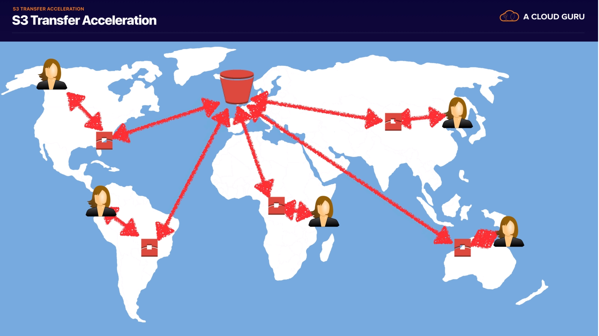
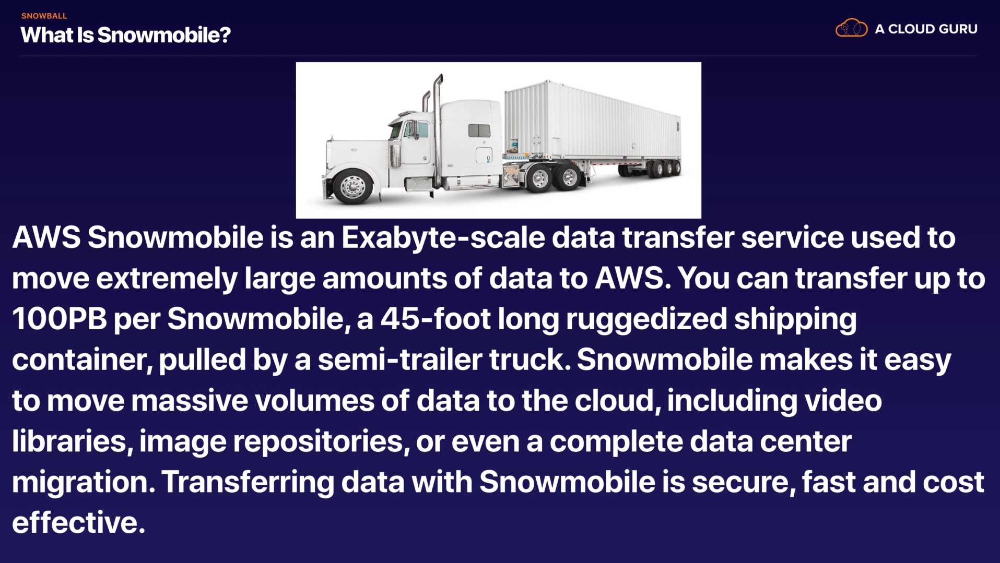
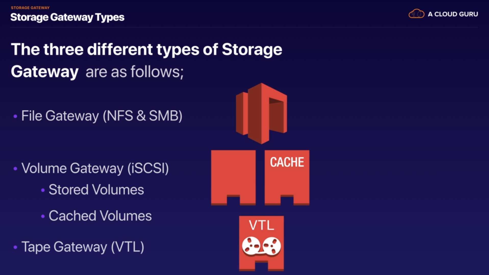
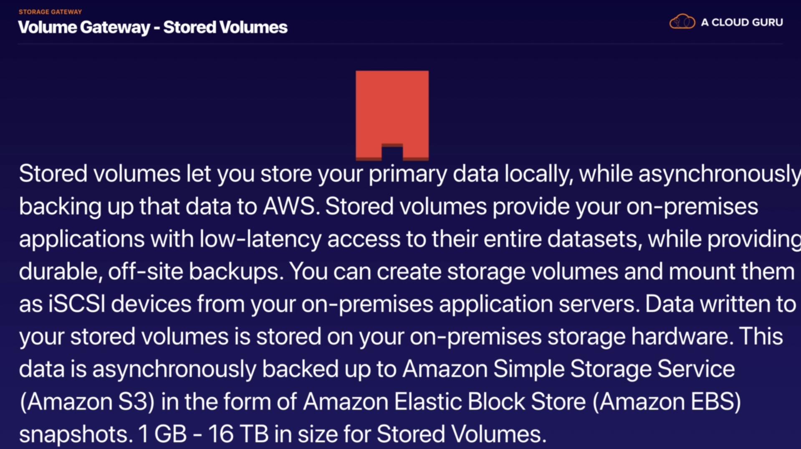

### AWS CERTIFIED SOLUTION ARCHITECT MATERIALS

Exams and their levels

Schemes:

Section 1: Basis

Schemes:

Section3: IAM

Section3: S3 Storage Information

.png)

Section3: S3 Encryption

.png)
,client.png)

Section3: S3 Versioning

Section3: S3 Lifecycle management

Section3: S3 Replication

Section3: S3 Transfer Acceleration

Section3: CloudFront

Invalidating Files:
If you need to remove a file from CloudFront edge caches before it expires, you can do one of the following:
Invalidate the file from edge caches. The next time a viewer requests the file, CloudFront returns to the origin to fetch the latest version of the file.
Use file versioning to serve a different version of the file that has a different name. For more information, see Updating Existing Files Using Versioned File Names.

Important:
You cannot invalidate objects that are served by an RTMP distribution.
To invalidate files, you can specify either the path for individual files or a path that ends with the * wildcard, which might apply to one file or to many, as shown in the following examples:
/images/image1.jpg

/images/image*

/images/*

Section3: Snowball

Section3: Storage Gateway - Basis

Section3: File Gateway

Section3: Volume Gateways

Stored Volumes:

Cached Volumes:

Tape Gateway:

Section3: S3 Exam tips

